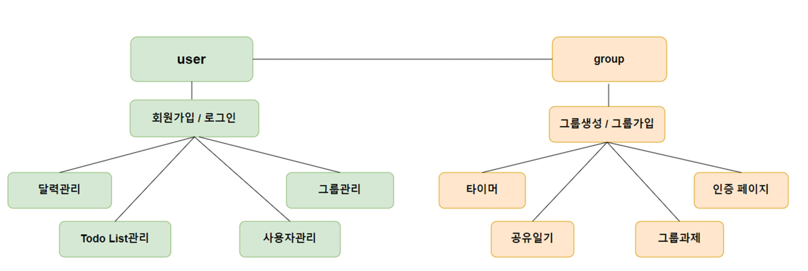
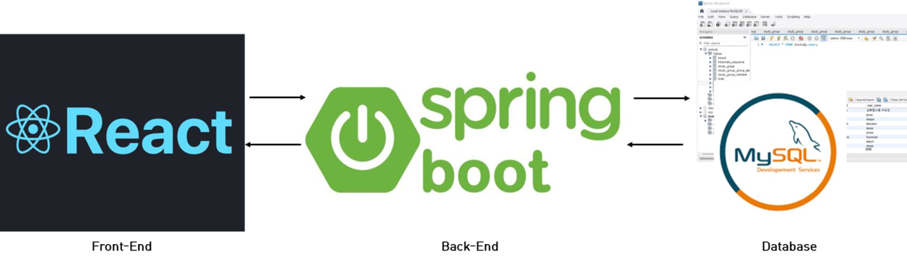

# 📘 Instudy

 2023 경기대학교 컴퓨터공학심화캡스톤 금123 4조

스터디 그룹 관리 및 그룹별 공유일기 플랫폼

## 🙂 Intro

- 팀 프로젝트의 구성부터 종료 이후 까지 관리하는 플랫폼 입니다.

- 플랫폼 구조

- 프로그램 구조


## 👤 Authors

- [@yeonsu00 (김연수)](https://github.com/yeonsu00)
- [@wwwls99 (남진수)](https://github.com/wwwls99)
- [@hido02 (김도희)](https://github.com/hido02)
- [@seeun01 (김세은)](https://github.com/seeun01)
- [@JaeWonna (정재원)](https://github.com/JaeWonna)


## ⚙️ Tech

**Client:** React, Material UI, Session Storage

**Server:** Spring, MySQL DB

## 📂 Project Structure

프로젝트 구조는 다음과 같습니다.

    .
    ├── web [Client]
    │   └── src
    │       ├── api
    │       ├── assets
    │       ├── components
    │       └── containers
            └── pages
            └── views
    └── server [Server]
        ├── controller
        └── domain
        └── repository
        └── service
 
## ✅ Features

    . [Client (Web)]
    ├── 그룹 
    │   ├── 그룹 생성
    │   │   ├── 그룹 소개
    │   │   ├── 인원수 설정
    │   │   └── 공부 태그 등록
    │   ├── 가입한 그룹 조회 및 신청
    │   ├── 그룹 과제
    │   │   ├── 과제 소개
    │   │   ├── 과제 기간 설정
    │   │   └── 멤버별 진행상황 확인
    │   └── 그룹 검색
    ├── 인증
    │   ├── 가입한 멤버 별 투두리스트
    │   ├── Good(인정), Bad(인정x)
    │   ├── 과반수 이상이면 인증 완료
    │   └── 인증에 대한 댓글
    ├── 타이머
    │   ├── 세션으로 페이지 이동 시 타이머 시간 유지
    │   ├── 타이머 리스트
    │   └── 총 공부한 시간
    └── 계정
        ├── 프로필
        │   ├── 프로필 수정
        │   ├── 가입한 스터디 그룹
        │   ├── 투두리스트
        │   ├── 이미지 업로드
        │   └── 캘린더
        ├── 회원가입
        └── 로그인/로그아웃


    . [Server (SpringBoot Application)]
    └── App 사용에 필요한 RESTful API 형태로 구현


## 🧩 Demo and Screenshots


## ✨ Run Locally

Clone the project

```bash
  git clone https://github.com/KGU-Team-Avocado/avocado-hero-web.git
```

Go to the project directory

```bash
  cd avocado-hero-web
```

Install dependencies

```bash
  npm install
```

Start the server

```bash
  npm start
```


## ✨ Installation

이 프로젝트를 설치하기 위해...

### 설치 경로

프로젝트는 반드시 C드라이브에 clone합니다.

    C://myPlug


### `npm install`

> **Note: 패키지 변화가 없으면 매번 작업을 할 필요가 없습니다.**

package.json에 있는 npm 설치 이력을 토대로 본인 컴퓨터에 패키지를 자동으로 설치합니다.
이 작업은 평소에 할 필요가 없지만, 누군가가 새 패키지를 설치하는 경우 다른사람들이 모두 해줘야 합니다.

    부가 옵션으로 과거 버전의 패키지를 설치하는 방법이 있습니다.
    npm install --legacy-peer-deps
    패키지 설치 시 더이상 과거 버전을 지원하지 않는다거나 권장하지 않는다고 설치를 거부하는 경우 레거시 버전을 설치하는 방법입니다.

    만약 위 명령어로도 설치가 불가능하면
    npm install --force
    강제로 설치하는 명령어도 있습니다.

각각의 폴더에서 npm 설치 작업을 진행하여야 합니다.
## ✨ Deployment

이 프로젝트를 실행하기 위해...

### `npm start`
> **Note: 아래 `install 명령어`를 먼저 실행할 필요가 있을 수도 있습니다.**

이 프로그램을 실행하게 합니다.
실행에 성공하면 Expo가 자동으로 실행됩니다.

Expo는 Android나 iOS에 설치 후 스마트폰에서 직접 실행이 가능합니다.

이 프로젝트를 수정하고 저장하면 자동으로 리로딩이 됩니다.
오류가 발생하면 터미널 콘솔창에 찍힙니다. (터미널에 찍히지 않는 경우에는 웹 브라우저에서 확인)

    부가 옵션으로 cache를 초기화 하면서 실행하는 방법이 있습니다.
    npm start --reset-cache
    분명 코드가 잘 들어갔고, 아무리 생각해도 문제가 없음에도 불구하고 오류가 발생하면 위 명령어로 실행하는 방법이 있습니다.


## 🔥 Support

For support, email yeonsu0329@kyonggi.ac.kr.
